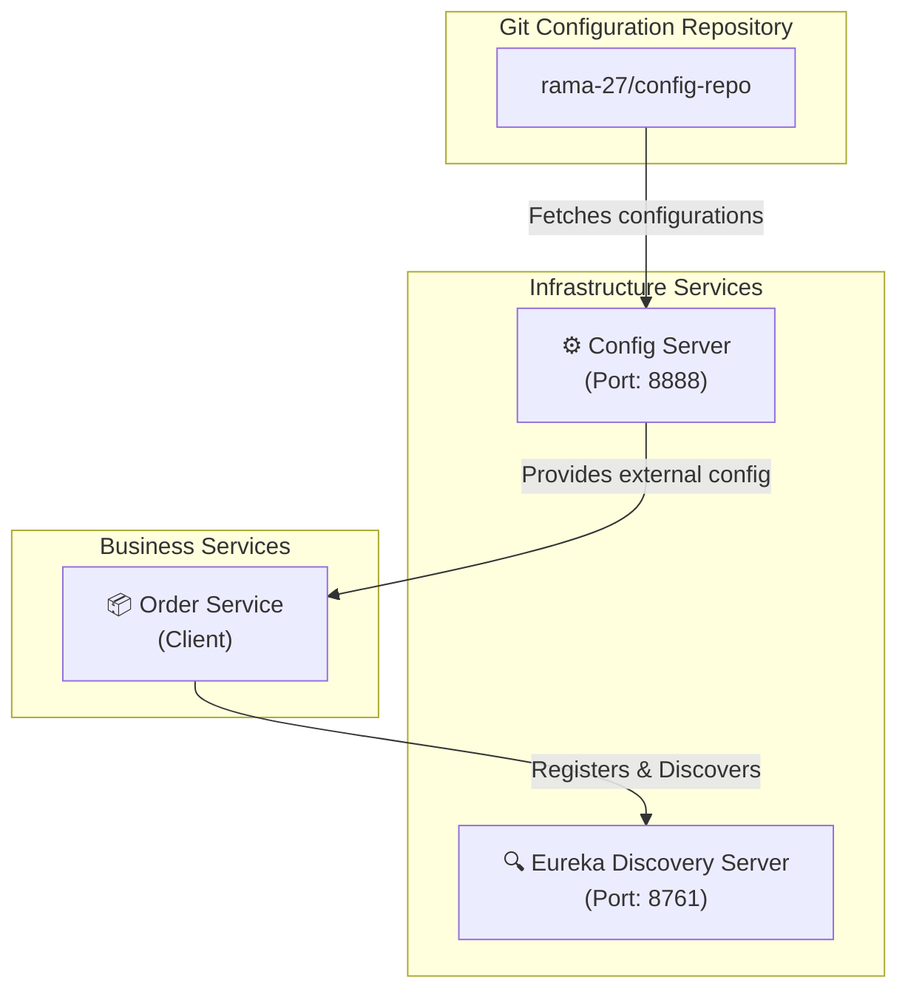

# Spring Cloud Microservices Architecture

A distributed microservices architecture built with **Java 17**, **Spring Boot**, and **Spring Cloud**. This repository demonstrates core microservice infrastructure patterns including centralized external configuration, dynamic service registration & discovery, and domain-specific microservices.

---

## 🏗 Architecture Overview



---

## 📦 Microservices & Modules

| Module | Service Type | Port | Description |
| :--- | :--- | :--- | :--- |
| [`config-server`](./config-server) | Spring Cloud Config Server | `8888` | Centralized configuration management backed by a remote Git repository. |
| [`server`](./server) | Netflix Eureka Discovery Server | `8761` | Service registry allowing microservices to discover and communicate with each other dynamically. |
| [`order-service`](./order-service) | Business Microservice / Client | Dynamic / Default | Core order management service functioning as both a Config Client and Eureka Client. |

---

## 🛠 Tech Stack

- **Java**: 17
- **Framework**: Spring Boot 4.x
- **Spring Cloud**: 2025.1.x
  - `spring-cloud-config-server` / `spring-cloud-starter-config`
  - `spring-cloud-starter-netflix-eureka-server` / `spring-cloud-starter-netflix-eureka-client`
  - `spring-boot-starter-web`
- **Build Tool**: Apache Maven (with Maven Wrapper `./mvnw`)

---

## 📂 Project Structure

```text
spring-microservicess/
├── config-server/              # Spring Cloud Config Server
│   ├── src/main/java/com/example/configserver/
│   │   └── ConfigServerApplication.java
│   ├── src/main/resources/
│   │   └── application.yaml    # Config server port & Git backend config
│   ├── pom.xml
│   └── mvnw
├── server/                     # Netflix Eureka Discovery Server
│   ├── src/main/java/com/example/server/
│   │   └── ServerApplication.java
│   ├── src/main/resources/
│   │   └── application.yaml    # Eureka server port & standalone settings
│   ├── pom.xml
│   └── mvnw
├── order-service/              # Order Business Microservice
│   ├── src/main/java/com/example/orderservice/
│   │   └── OrderServiceApplication.java
│   ├── src/main/resources/
│   │   └── application.yaml    # Application name & Config Server import
│   ├── pom.xml
│   └── mvnw
└── README.md
```

---

## 🚀 Getting Started

### Prerequisites

- **Java Development Kit (JDK)**: Java 17 or higher
- **Maven**: Optional (bundled Maven Wrapper `./mvnw` is included in each module)
- **Git**: For source version control

---

### Recommended Startup Order

To allow services to properly fetch configurations and register with the service registry on boot, start the modules in the following sequence:

#### 1️⃣ Step 1: Start Config Server (`config-server`)
```bash
cd config-server
./mvnw spring-boot:run
```
- **Port**: `http://localhost:8888`
- **Verification**: Check configuration retrieval via browser or curl:
  ```bash
  curl http://localhost:8888/order-service/default
  ```

#### 2️⃣ Step 2: Start Eureka Discovery Server (`server`)
```bash
cd ../server
./mvnw spring-boot:run
```
- **Port**: `http://localhost:8761`
- **Verification**: Open Eureka Web Dashboard in your browser:
  ```text
  http://localhost:8761
  ```

#### 3️⃣ Step 3: Start Order Service (`order-service`)
```bash
cd ../order-service
./mvnw spring-boot:run
```
- On startup, `order-service` will:
  1. Connect to Config Server at `http://localhost:8888` to import external configurations.
  2. Register itself with the Eureka Discovery Server at `http://localhost:8761`.
- **Verification**: Check the Eureka dashboard at `http://localhost:8761` to confirm `ORDER-SERVICE` is listed under **Instances currently registered with Eureka**.

---

## ⚙️ Configuration & Key Settings

### Config Server (`config-server/src/main/resources/application.yaml`)
```yaml
server:
  port: 8888
spring:
  application:
    name: config-server
  cloud:
    config:
      server:
        git:
          uri: https://github.com/rama-27/config-repo
```

### Eureka Server (`server/src/main/resources/application.yaml`)
```yaml
server:
  port: 8761
spring:
  application:
    name: server
eureka:
  client:
    register-with-eureka: false
    fetch-registry: false
```

### Order Service (`order-service/src/main/resources/application.yaml`)
```yaml
spring:
  application:
    name: order-service
  config:
    import: "optional:configserver:http://localhost:8888"
```

---

## 🔨 Build & Package

To build and package all services individually into executable JAR files:

```bash
# Build Config Server
cd config-server && ./mvnw clean package -DskipTests && cd ..

# Build Eureka Server
cd server && ./mvnw clean package -DskipTests && cd ..

# Build Order Service
cd order-service && ./mvnw clean package -DskipTests && cd ..
```

To run packaged JARs:
```bash
java -jar config-server/target/config-server-0.0.1-SNAPSHOT.jar
java -jar server/target/server-0.0.1-SNAPSHOT.jar
java -jar order-service/target/order-service-0.0.1-SNAPSHOT.jar
```

---

## ➕ Adding a New Microservice

To add a new microservice to this architecture:

1. Create a Spring Boot application with Java 17.
2. Add the required dependencies to `pom.xml`:
   - `spring-cloud-starter-config` (for external configuration)
   - `spring-cloud-starter-netflix-eureka-client` (for service discovery)
   - `spring-boot-starter-web` (for REST endpoints)
3. Configure `src/main/resources/application.yaml`:
   ```yaml
   spring:
     application:
       name: <your-service-name>
     config:
       import: "optional:configserver:http://localhost:8888"
   ```
4. Annotate the main class with `@SpringBootApplication` and run the service.

---

## 📜 License

This project is licensed under the MIT License - see the [LICENSE](LICENSE) file for details (if applicable).
